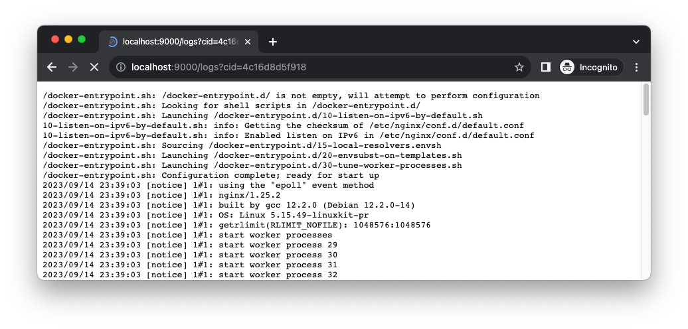
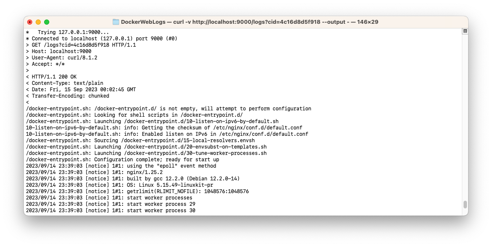

# DockerWebLogs
It simply texts docker logs to web console.

## How to run it

Firstly use command line: `go run .` or `go build && ./DockerWebLogs` to start the server.  
Then open a brower with url: <http://localhost:90000/logs?cid=xxx> or use command cURL: `curl -v "http://localhost:9000/logs?cid=xxx" --output -` to read container logs.   
**Note:** change the 'xxx" to a real container id.

